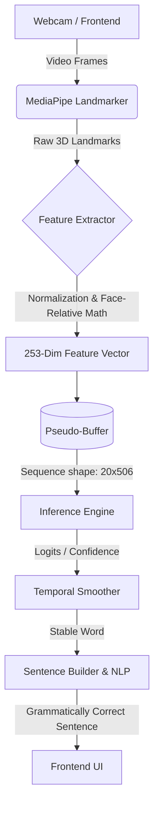

# System Architecture

The ISL Sign-to-Text module is designed for real-time edge execution. It is decoupled into distinct stages: feature extraction, temporal buffering, ML inference, and Natural Language Processing (NLP).

## High-Level Data Flow

## Core Components

### 1. Feature Extractor (`src/shared/feature_extractor.py`)

This is the **Single Source of Truth** for spatial feature conversion. It takes 63-dimensional hand landmarks and 792-dimensional face landmarks and produces a fixed `253` length vector per frame.

- **Normalization:** Hands are centered on the wrist (landmark 0) and scaled by the maximum Euclidean distance to the wrist.
- **Face-Relative Coordinates:** Hand coordinates are projected relative to the nose anchor, divided by the interpupillary distance to account for camera distance.
- **Velocity:** Inter-frame velocity is dynamically computed (resulting in a final `506` dimension vector entering the model).

### 2. Temporal Pseudo-Buffer (`src/inference/pseudo_buffer.py`)

Handles streaming input gracefully. It collects real-time frames and uses a shifting window of `NUM_FRAMES` (default 20). It avoids running the model when motion is below the threshold, saving CPU cycles.

### 3. Model Architecture (`src/training/model.py`)

The ML pipeline is a hybrid spatial-temporal model:
- **Spatial GNN:** Graph Convolutional Network that learns structural relationships between joints.
- **BiGRU:** Bidirectional Gated Recurrent Units for modeling the temporal sequence of the sign.
- **Self-Attention:** Weighs critical frames higher during the gesture sequence.

### 4. API Layer (`api/app.py`)

FastAPI wraps the inference engine using a WebSocket (`/ws/translate`). The frontend client extracts MediaPipe landmarks natively via WebAssembly and transmits only the lightweight coordinate vectors, maintaining low network latency.

**API Versioning (v1 Contract):**
- All endpoints in `api/app.py` and `api/schemas.py` follow the `v1` contract.
- Changing `feature_dimension` (e.g. 506 to 620), `sequence_length`, core URL paths, or JSON fields will necessitate a `v2` bump.
- Minor version additions (e.g., adding `/metrics` or optional payload fields) are permitted.

**Error Handling:**
Common errors include:
- `E001` (Feature dimension mismatch)
- `E002` (Invalid schema version)
- `E003` (Missing sequence frames)
- `E004` (Flood protection, dropped WebSocket frames)
- `E006` (Invalid normalization values)

## Storage Optimization (HDF5)

During training, dataset loading bottlenecked GPU utilization. The system compiles millions of single-frame `.npy` arrays into a single `dataset.h5` file.

This reduces File I/O operations from $O(N)$ to $O(1)$, yielding a 200× faster initialization latency.

## Latency vs. Accuracy Trade-offs

To guarantee real-time performance on edge CPUs (under 200 ms end-to-end), intentional compromises were made:
- **HOG Person Detection Disabled:** HOG-based person detection was removed (`disable_hog_detection = True`) to shave off ~8ms of latency per frame. The team accepted a trade-off between lower latency and reduced person-aware filtering capability, assuming the background will mostly have a single signer.
- **ONNX INT8 Quantization:** PyTorch models are explicitly exported and quantized to INT8 to maintain high FPS, preferring throughput over minimal precision losses.
