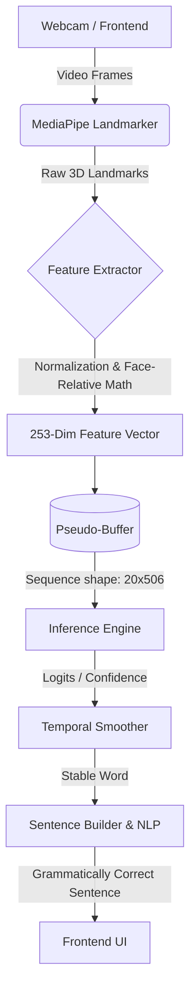

# System Architecture

The ISL Sign-to-Text module is designed for real-time edge execution. It is decoupled into distinct stages: feature extraction, temporal buffering, ML inference, and Natural Language Processing (NLP).

## High-Level Data Flow



## Core Components

### 1. Feature Extractor (`src/shared/feature_extractor.py`)

This is the **Single Source of Truth** for spatial feature conversion. It takes 63-dimensional hand landmarks and 792-dimensional face landmarks and produces a fixed `253` length vector per frame.

- **Normalization:** Hands are centered on the wrist (landmark 0) and scaled by the maximum Euclidean distance to the wrist.
- **Face-Relative Coordinates:** Hand coordinates are projected relative to the nose anchor, divided by the interpupillary distance to account for camera distance.
- **Velocity:** Inter-frame velocity is dynamically computed (resulting in a final `506` dimension vector entering the model).

### 2. Temporal Pseudo-Buffer (`src/inference/pseudo_buffer.py`)

Handles streaming input gracefully. It collects real-time frames and uses a shifting window of `NUM_FRAMES` (default 20). It avoids running the model when motion is below the threshold, saving CPU cycles.

### 3. Model Architecture (`src/training/model.py`)

The ML pipeline is a hybrid spatial-temporal model:
- **Spatial GNN:** Graph Convolutional Network that learns structural relationships between joints.
- **BiGRU:** Bidirectional Gated Recurrent Units for modeling the temporal sequence of the sign.
- **Self-Attention:** Weighs critical frames higher during the gesture sequence.

### 4. API Layer (`api/app.py`)

FastAPI wraps the inference engine using a WebSocket (`/ws/translate`). The frontend client extracts MediaPipe landmarks natively via WebAssembly and transmits only the lightweight coordinate vectors, maintaining low network latency.

**API Versioning (v1 Contract):**
- All endpoints in `api/app.py` and `api/schemas.py` follow the `v1` contract.
- Changing `feature_dimension` (e.g. 506 to 620), `sequence_length`, core URL paths, or JSON fields will necessitate a `v2` bump.
- Minor version additions (e.g., adding `/metrics` or optional payload fields) are permitted.

**Error Handling:**
Common errors include:
- `E001` (Feature dimension mismatch)
- `E002` (Invalid schema version)
- `E003` (Missing sequence frames)
- `E004` (Flood protection, dropped WebSocket frames)
- `E006` (Invalid normalization values)

## Storage Optimization (HDF5)

During training, dataset loading bottlenecked GPU utilization. The system compiles millions of single-frame `.npy` arrays into a single `dataset.h5` file.


This reduces File I/O operations from $O(N)$ to $O(1)$, yielding a 200× faster initialization latency.

## Latency vs. Accuracy Trade-offs

To guarantee real-time performance on edge CPUs (under 200 ms end-to-end), intentional compromises were made:
- **HOG Person Detection Disabled:** HOG-based person detection was removed (`disable_hog_detection = True`) to shave off ~8ms of latency per frame. The team accepted a trade-off between lower latency and reduced person-aware filtering capability, assuming the background will mostly have a single signer.
- **ONNX INT8 Quantization:** PyTorch models are explicitly exported and quantized to INT8 to maintain high FPS, preferring throughput over minimal precision losses.


---


# Model Architecture — SignLanguageGRU

## Overview

The `SignLanguageGRU` model is a multi-branch deep learning classifier combining a Spatial GNN, Conv1D temporal frontend, Bidirectional GRU, and proximity-aware attention. All 10 architectural improvements (Phases 1–10) are enabled by default.

## Input

| Property | Value |
|---|---|
| Shape | `(batch, 20, 506)` |
| Sequence length | 20 frames (~667 ms at 30 FPS) |
| Feature dim | 506 = 253 base features × 2 (with velocity) |

## Data Flow

### Branch A — Spatial GNN (`src/training/spatial_gnn.py`)

**Input:** First 126 dims of each frame (raw hand landmark coordinates).

- Hand landmarks are reshaped to `(batch × 20, 2, 21, 3)` — 2 hands, 21 nodes, 3 coords
- A `LightweightSpatialGNN` applies 2-layer Graph Convolution over the anatomical hand skeleton (21 nodes per hand, edges = known metacarpal → proximal → medial → distal finger joint connections)
- GCN layer 1: Linear(3 → 16) + adjacency-weighted neighbor aggregation + ReLU
- GCN layer 2: Linear(16 → 8) + adjacency aggregation + ReLU
- Global max-pool over 21 nodes per hand → 8 dims per hand
- Both hands concatenated → **16 dims per frame**
- Optional: shared GNN weights between left/right hands (halves parameters)

### Branch B — Conv1D Frontend (Phase 1)

**Input:** All 506 dims of each frame.

- Pointwise Conv1d(506 → 128, kernel=1): feature mixing, dimension reduction
- Depthwise temporal Conv1d(128 → 128, kernel=3, groups=128, padding=1): local temporal pattern extraction
- Residual connection from pointwise output
- GroupNorm(8 groups) → ReLU → Dropout(0.1)
- **Output:** `(batch, 20, 128)`

### Fusion

- Concatenate GNN output (16) + Conv1D output (128) = **144 dims per frame**

### Learnable Frame Weighting (Phase 2)

- MLP: `Linear(144→32) → ReLU → Linear(32→1) → Sigmoid`
- Produces a scalar weight per frame: `weights.shape = (batch, 20, 1)`
- Applied as element-wise multiplication to the fused features
- Allows the model to soft-suppress uninformative transition frames

### Input Projection

- `Linear(144 → 64)` → `LayerNorm(64)` → `ReLU`
- Projects to GRU input space

### Bidirectional GRU (Phase 4)

| Property | Value |
|---|---|
| Layers | 3 stacked |
| Hidden dim | 64 per direction |
| Bidirectional | Yes (forward + backward) |
| Output dim | 128 (concatenated) |
| Inter-layer dropout | 0.30 |
| Post-GRU norm | LayerNorm(128) |

Output shape: `(batch, 20, 128)`

### HybridAttention

4 attention heads operating on GRU output:

| Head type | Count | Description |
|---|---|---|
| Standard temporal | 2 | Learn which frames carry the most information |
| Proximity-aware | 2 | Attention scores additively biased by `log N(prox; 0, σ²)` where σ=0.15 is learnable |

Each head has an independent **learnable temperature** clamped to [0.1, 10.0].
Each head output: 32 dims. All 4 concatenated → 128-dim context vector.

**Residual skips (Phases 5 & 9):**
- Phase 9: `context += gru_out.mean(dim=1)` — temporal mean residual
- Phase 5: `context += input_proj.mean(dim=1)` — input projection residual (if dims align)

### FC Classification Head

```
Dropout(0.25)
→ Linear(128 → 96)
→ ReLU
→ Dropout(0.25)
→ Linear(96 → num_classes)
→ logits (300 classes)
```

## Parameter Count

*(Parameter count computed from current implementation: `sum(p.numel() for p in model.parameters())`)*

| Component | Approximate Parameters |
|---|---|
| Spatial GNN | ~2K |
| Conv1D Frontend | ~70K |
| Frame Weighting MLP | ~5K |
| Input Projection | ~9K |
| BiGRU × 3 layers | ~225K |
| HybridAttention | ~20K |
| FC Head | ~13K |
| **Total** | **343,976 (~344K)** |

## ONNX Export

The model is exported to ONNX format (opset 18) using `scripts/export_onnx.py`:
- Dynamic batch size
- Fixed sequence length (20)
- Automatic `num_classes` inference from checkpoint
- Writes `*_metadata.json` alongside the ONNX file

Dynamic INT8 quantization is applied via `scripts/quantize_onnx.py`:
- ~75% size reduction (4.2 MB FP32 → ~1.05 MB INT8)
- 2–3× faster CPU inference vs PyTorch FP32

## Ablation Flags

All architectural phases can be individually toggled in `ArchitectureImprovementsConfig`:

| Flag | Phase | Default |
|---|---|---|
| `use_conv_frontend` | Phase 1 | `True` |
| `use_frame_weighting` | Phase 2 | `True` |
| `use_depthwise_temporal` | Phase 4 | `True` |
| `use_residual_gru_skip` | Phase 5 | `True` |
| `use_groupnorm` | Phase 6 | `True` |
| `use_residual_attention_skip` | Phase 9 | `True` |
| `use_gnn` | Phase 10 | `True` |


---


# Dataset Documentation

## Overview

The ISL Sign-to-Text dataset consists of processed landmark sequences (`.npy` files) extracted from raw webcam videos of Indian Sign Language signs.

## Dataset Structure

```
assets/
├── Dataset/                     ← Raw video files
│   ├── hello/
│   │   ├── hello_001.mp4
│   │   ├── hello_002.mp4
│   │   └── ...
│   └── <class_name>/
│
├── augmented_dataset/           ← Video-augmented versions (before preprocessing)
│   └── (same structure as Dataset/)
│
├── processed/                   ← Preprocessed .npy sequences (primary training set)
│   ├── hello/
│   │   ├── hello_001.npy        ← shape: (20, 506), dtype: float32
│   │   ├── hello_001_aug3.npy   ← augmented variant
│   │   └── ...
│   └── <class_name>/
│
├── processed_del/               ← Archived samples (removed by quality filter)
│   └── (same structure — used in Phase 2 fine-tuning at weight 0.25)
│
├── processed_negatives/         ← Background/non-sign sequences (__reject__ class)
│
├── dataset.h5                   ← Compiled HDF5 dataset container (optimized storage)
├── validation_report.json       ← Metadata and integrity hash for dataset.h5
│
└── ensemble/                    ← K-fold model checkpoints
    ├── fold_0.pth
    ├── fold_1.pth
    ├── fold_2.pth
    ├── fold_3.pth
    ├── fold_4.pth
    └── kfold_manifest.json      ← Per-fold accuracy and timestamps
```

## Processed Sequence Format

Each `.npy` file is a NumPy array of shape `(20, 506)` and dtype `float32`.

### Feature Layout (per frame, 506 dims total)

| Slice | Dims | Content |
|---|---|---|
| `[0:63]` | 63 | Left hand raw landmarks (21 × 3) |
| `[63:126]` | 63 | Right hand raw landmarks (21 × 3) |
| `[126:189]` | 63 | Left hand face-relative landmarks |
| `[189:252]` | 63 | Right hand face-relative landmarks |
| `[252]` | 1 | Hand-to-face proximity scalar |
| `[253:506]` | 253 | Velocity delta (frame-to-frame difference) |

**Missing hand:** If a hand is not detected in a frame, its 63-dim raw block and 63-dim face-relative block are filled with zeros.

**Missing face:** If the face landmarker fails, both face-relative blocks are zero-filled. The proximity scalar is also zeroed.
## Dataset Statistics

| Metric | Value |
|---|---|
| Sign classes | 300 (includes `__reject__` and `__transition__`) |
| Total stored sequences | 93,798 (processed, processed_del, processed_negatives) |
| Effective training diversity | > 100,000 (after Mixup & Phase 2 noise injection) |
| Average samples per class | ~73 (before augmentation) |
| Target samples per class | 850 (after balancing) |
| Sequence shape | (20, 506) |
| Feature dtype | float32 |
| Frame sampling | 20 frames uniformly spaced via `np.linspace` |
| Webcam resolution | 640 × 480 px |

## Sign Categories

Defined in `data/sign_categories.json`:

- **Pronouns:** I, he, she, it, we, you, you_all, they
- **Adjectives:** beautiful, ugly, loud, quiet, happy, sad, deaf, blind, nice, rich, poor, thick, thin, expensive, cheap, flat, curved, male, female, tight, loose
- **States/Descriptors:** big_large, small_little, fast, slow, heavy, light, tall, short, long, narrow, wide, deep, shallow, hot, cold, warm, clean, dirty, dry, wet, soft, hard, strong, weak, old, new, young, famous, healthy, sick, dead, alive, high, low
- **Greetings:** Hello, How_are_you, Alright, Good_Morning, Morning, Good_afternoon, Good_evening, Good_night
- **Social:** Thank_you, Pleased, bad, mean, cool, Idle
- **Numeric:** 0, 1, 2

## Hand Count Classification

`data/hand_sign_classification.json` is auto-generated by `scripts/update_hand_classification.py` by analyzing the `processed/` dataset.

It measures what percentage of frames in each class have both hands active (non-zero). Signs with ≥ 20% two-hand frame presence are classified as `two_hands`.

## Augmentation Summary

### Video-Level (before preprocessing)

| Type | Variants |
|---|---|
| Visual effects | 17 effects (brightness, contrast, blur, noise, gamma, etc.) |
| Crop positions | 3 (center, left 15%, right 85%) |
| **Total combinations** | **Up to 54 per source video** |

### Landmark-Level (on processed .npy)

| Augmentation | Probability |
|---|---|
| Gaussian noise injection (σ=0.015) | 70% |
| Random scaling (0.88–1.12×) | 60% |
| Temporal frame shift (±3 frames) | 50% |
| TimeMasking (contiguous drops) & Scattered Dropout | 30% |
| XY rotation (±15°) | 40% |
| Time warping (0.75–1.25× speed) | 40% |
| Per-hand dropout | 20% |
| Localized noise burst | 25% |
| Face-anchor shift | configurable |
| Hand proportion variation | configurable |

### Merge Augmentation

Frame-splicing between same-class recordings:
- Modes: `splice`, `crossfade_splice`, `blend`, `hand_swap`, `tempo_aligned_splice`, `hybrid`
- Generates stylistically diverse samples from real data

## Dataset Management Scripts

| Script | Purpose |
|---|---|
| `src/tools/compile_hdf5.py` | Compiles `.npy` into a single HDF5 container (`assets/dataset.h5`) for 391x faster startup |
| `scripts/balance_processed_dataset.py` | Balance all classes to a target count |
| `scripts/random_downsample_processed.py` | Safe class downsampling (protects originals) |
| `scripts/quality_filter_hybrid.py` | Remove near-duplicates + select diverse subset |
| `main.py --cleanup` | Integrated cleanup via pipeline CLI |

## Synthetic Data Evolution (CVAE vs GAN)

The team evaluated methods to combat data scarcity using synthetic skeleton generation:
- **GAN Rejection:** GAN-based approaches were considered but ultimately not adopted. Deterministic augmentation already addressed most variability requirements while avoiding the additional training complexity and high risk of temporally inconsistent sequences.
- **CVAE Experiments:** An experimental Conditional Variational Autoencoder (CVAE) pipeline (`experimental/cvae_landmarks.py`, `experimental/quality_discriminator.py`) is used strictly as a research direction for exploring synthetic landmark generation. It allows generating class-balanced synthetic sequences by sampling from the latent space, but relies heavily on a separate GRU-based quality discriminator to filter out unrealistic samples before they can be considered for training.


---


# Training Pipeline

## Overview

The ISL Sign-to-Text training pipeline is a 10-stage process from raw video recording to a deployable ONNX INT8 model.

## Quick Reference

```bash
# Full pipeline (steps 1–10)
python main.py --collect --cls hello --n 50    # Step 1: collect
python main.py --augment-videos                # Step 3: augment videos
python main.py --preprocess                    # Step 4: extract landmarks
python main.py --augment-landmarks             # Step 5: augment landmarks
python main.py --merge                         # Step 6: merge augmentation
python main.py --cleanup                       # Step 7: diversity cleanup
python main.py --kfold                         # Step 8: K-fold training
python scripts/export_onnx.py                  # Step 9: ONNX export
python scripts/quantize_onnx.py                # Step 10: INT8 quantize
```

---

## Step-by-Step

### Step 1 — Data Collection

```bash
python main.py --collect --cls <sign_name> --n 50
```

- Records 50 training samples via webcam
- 3-second countdown before each recording
- Each sample: 90 raw frames at 640×480 px
- Saved to `assets/Dataset/<sign_name>/`

### Step 2 — (Optional) Negative Samples

Collect background / non-sign sequences:

```bash
python main.py --collect --cls __reject__ --n 50
# Move to processed_negatives/ after preprocessing
```

### Step 3 — Video Augmentation

```bash
python main.py --augment-videos \
    --augment-input-dir assets/Dataset \
    --augment-output-dir assets/augmented_dataset \
    --augment-max-per-class 900
```

Generates up to 54 augmented video variants per source video:
- 17 visual effects (brightness, contrast, motion blur, JPEG artifacts, etc.)
- 3 crop positions (center, left 15%, right 85%)

### Step 4 — Landmark Extraction (Preprocessing)

```bash
python main.py --preprocess
# or from augmented:
python main.py --preprocess --preprocess-dir assets/augmented_dataset
```

For each video:
1. Uniformly samples 20 frames via `np.linspace`
2. Runs MediaPipe HandLandmarker + FaceLandmarker per frame
3. Constructs 253-dim base feature vector (126 raw + 126 face-relative + 1 proximity)
4. Appends 253-dim velocity delta → **506-dim per frame**
5. Saves `(20, 506)` NumPy array to `assets/processed/<class>/`

### Step 5 — Landmark Augmentation

```bash
python main.py --augment-landmarks \
    --augment-landmarks-n 14
```

Applies 14 of 20 available deterministic augmentations to each `.npy` file:
- 3D rotation (±15°), scaling (0.88–1.12×), translation
- Temporal: speed warp, time shift, TimeMasking (contiguous drops), Scattered Dropout
- Occlusion: per-hand dropout, fog noise, coarse dropout
- Recomputes proximity scalar and velocity after coordinate changes

### Step 6 — Merge Augmentation

```bash
python main.py --merge --merge-n 3 --merge-mode crossfade_splice
```

Splices frame ranges from different recordings of the same class:
- Modes: `splice`, `crossfade_splice`, `blend`, `hand_swap`, `tempo_aligned_splice`
- Creates stylistically diverse synthetic samples from real data

### Step 7 — Diversity Cleanup

```bash
python main.py --cleanup \
    --cleanup-max-aug 600 \
    --cleanup-max-merge 200
```

Removes near-duplicates using L2-normalized cosine distance, then selects the most diverse subset via Farthest Point Sampling (FPS).

### Step 8 — K-Fold Training

```bash
python main.py --kfold
# With negatives:
python main.py --kfold --neg-root processed_negatives
```

**Per fold:**
1. Disjoint stratified split (70% train / 30% validation)
2. `ISLDataset` loads `.npy` files with on-the-fly augmentation
3. Training: AdamW, cosine LR scheduler, label smoothing 0.05, mixup α=0.3
4. Best checkpoint saved to `assets/ensemble/fold_N.pth`
5. Fold accuracy recorded in `assets/ensemble/kfold_manifest.json`

**Two-phase training (optional):**
- Phase 1: train on `processed/` only
- Phase 2: fine-tune adding `processed_del/` at weight 0.25

```bash
python main.py --kfold \
    --finetune-archived-epochs 15 \
    --finetune-archived-lr 3e-5
```

### Step 9 — ONNX Export

```bash
python scripts/export_onnx.py \
    --checkpoint models/model.pth \
    --output models/model_fp32.onnx
```

- Opset 18, dynamic batch size
- Traces model with a synthetic input
- Writes `model_fp32_metadata.json` with class list and config hash

### Step 10 — INT8 Quantization

```bash
python scripts/quantize_onnx.py \
    --input models/model_fp32.onnx \
    --output models/model_int8.onnx
```

- Dynamic INT8 quantization via `onnxruntime.quantization.quantize_dynamic`
- Result: ~1.05 MB (from ~4.2 MB FP32)
- Writes `*_quantization_metadata.json`

---

## Training Configuration

All hyperparameters are in `src/core/config.py` → `TrainingConfig`:

| Parameter | Default | Notes |
|---|---|---|
| `batch_size` | 8 | Small batches for limited per-class counts |
| `learning_rate` | 3e-4 | Reduced from 5e-4 for stability on current dataset boundaries |
| `weight_decay` | 5e-4 | Increased for better regularization |
| `grad_clip` | 1.0 | Gradient norm clipping |
| `num_epochs` | 50 | With early stopping |
| `patience` | 10 | Reduced from 20 to ensure stable convergence |
| `val_split` | 0.30 | Stratified 70/30 split |
| `label_smoothing` | 0.05 | Prevents overconfident predictions |
| `use_class_weights` | True | Inverse frequency, power=1.0 |
| `lr_scheduler` | cosine | ReduceLROnPlateau with cosine decay |

## Continuous Learning (Adapter)

The continuous learning `AdapterModel` trains on live pseudo-labels. Strict safety thresholds (`adapter_min_saved_samples = 40`, `adapter_min_classes = 3`) constrain when adaptation is allowed during live operation. 

*Rationale:* This acts as a safeguard intended to reduce the risk of unstable adaptation from pseudo-labeled live data.


---


# Inference Pipeline

## Overview

The live inference pipeline runs at 30 FPS and delivers end-to-end predictions in under 200 ms. It uses ONNX INT8 as the primary inference backend with automatic PyTorch FP32 fallback.

## Stage-by-Stage Latency Budget

| Stage | Target Latency | Notes |
|---|---|---|
| Frame capture | ~0.5 ms | OpenCV VideoCapture |
| MediaPipe (detect frame) | 30–40 ms | Every 5 frames |
| MediaPipe (cached frame) | < 5 ms | Reused landmarks |
| Feature construction | < 2 ms | Pre-allocated buffers |
| ONNX INT8 inference | 15–30 ms | Full 20-frame window |
| Heuristic adjustment | < 1 ms | Multiplicative penalty |
| Temporal post-processing | < 1 ms | Sliding window |
| Sentence builder | < 1 ms | Deque + state machine |
| **Total (detect frame)** | **~80–120 ms** | |
| **Total (cached frame)** | **~30–50 ms** | |

## Stage 1 — Adaptive Landmark Detection

**File:** `src/core/webcam.py`

Detection is gated by an adaptive interval counter:

```
base interval = 5 frames
low-motion multiplier = 2.0 (up to max 8 frames)
forced re-detect = every 15 frames
```

- **Hand detection (on interval):** MediaPipe HandLandmarker detects up to 2 hands, returning 21 normalized (x,y,z) landmarks per hand and `handedness` (Left/Right label)
- **Face detection (on interval):** MediaPipe FaceLandmarker returns 478 face landmarks; only 3 are used (nose tip=1, left eye=33, right eye=263)
- **Cached frames:** Previous landmark results reused directly, skipping MediaPipe entirely

HOG-based person detection is **disabled** (`disable_hog_detection=True`) — saves ~8 ms/frame, no accuracy loss.

## Stage 2 — Feature Vector Construction

**File:** `src/preprocessing/preprocess.py` → `extract_landmarks_with_face_relative()`

For each frame:

1. **Raw hand block** (126 dims): left hand 63 dims + right hand 63 dims, in MediaPipe normalized coordinates
2. **Face-relative block** (126 dims): each landmark expressed as `(lm - nose_tip) / inter_eye_distance`; zero-filled if face not detected
3. **Proximity scalar** (1 dim): L2 distance from hand centroid to nose tip
4. **Velocity delta** (253 dims): `f_t - f_{t-1}`; zero at frame 0

Total: **506 dims per frame**

Pre-allocated module-level buffers (`_LANDMARK_BUFFERS`) avoid per-frame NumPy allocation.

## Stage 3 — Sequence Buffer

`collections.deque(maxlen=20)` accumulates frames. Once full, inference is triggered on every new frame (sliding window). Buffer → `np.array` of shape `(1, 20, 506)`.

## Stage 4 — ONNX INT8 Inference

**File:** `src/inference/onnx_inference.py` → `ONNXModelWrapper`

1. Feature dimension alignment (pad/truncate if input dim differs from model's expected dim)
2. Proximity vector rank adjustment
3. ONNX Runtime session invoke
4. On failure → automatic PyTorch FP32 fallback

Output: logits `(1, 300)` → softmax → probability vector `(300,)`

**Ensemble mode:** `src/inference/onnx_ensemble_integration.py` averages predictions from up to 5 fold checkpoints (configured via `LiveInferenceConfig.ensemble_size`).

## Stage 5 — Soft Heuristic Adjustment Layer

**File:** `src/core/webcam.py`

Before temporal smoothing, the raw GRU probabilities are adjusted via deterministic heuristic rules based on JSON metadata (`data/hand_sign_classification.json`):

1. **Feature Extraction:** Live webcam features (e.g., hand count) are continuously tracked.
2. **Confidence Gating:** Heuristics are only applied if the live visual confidence (e.g., MediaPipe hand presence) exceeds `0.7`.
3. **Multiplicative Penalty:** If the live feature mismatches the expected sign feature (e.g., seeing 1 hand for a `two_hands` sign), a multiplicative penalty (e.g., `0.6`) is applied to that sign's probability.
4. **Dominance:** This soft penalty ensures the model remains the primary decider, safely reshaping probabilities without catastrophic hard-filtering.

## Stage 6 — Temporal Post-Processing

**File:** `src/inference/temporal_postprocessor.py`

### ConfidenceSmoother

- Maintains a sliding window deque of 8 probability vectors
- Each entry weighted by: `confidence_score × exp_decay^(age)`; decay factor = 0.3
- More recent frames carry proportionally more weight
- Weighted average is renormalized to sum to 1

### StablePredictor

- Maintains a candidate class + patience counter
- A class switch is confirmed only when:
  - Same class predicted for **3 consecutive frames**
  - Smoothed confidence exceeds current stable class by **≥ 0.12** (hysteresis)

## Stage 7 — Momentum Commit

**File:** `src/core/webcam.py`

A sign is committed to the sentence when:
- **3-of-5 majority:** the class appears ≥ 3 times in the 5 most recent stable predictions
- **Minimum confidence:** average confidence of agreeing predictions ≥ 0.60
- **Ambiguity delay:** if top-1 minus top-2 probability < 0.05, wait 4 additional frames

## Stage 8 — Sentence Builder + NLP

**File:** `src/inference/sentence_builder.py`, `src/inference/nlp_postprocessor.py`

The `SentenceBuilder` uses a debouncing state machine to prevent noise during rapid gesture sequences:

- **State Machine Debounce:** `__reject__` or `__transition__` classes are ignored unless they persist for ≥ 3 consecutive frames (`separator_counter`).
- **Duplicate Suppression:** Prevents appending the exact same word consecutively via an aggressive 45-frame cooldown (~1.5 s at 30 FPS) before the same word can be predicted again (`same_word_cooldown_frames = 45`).
- **Idle Timeout:** If no hands are detected for `30 frames`, the state resets.
- `nlp_postprocessor` applies: capitalization, grammatical connectors, punctuation normalization

## Confidence Threshold System

| Threshold | Value | Purpose |
|---|---|---|
| Base | 0.12 | Minimum confidence to accept any prediction |
| Hysteresis | 0.12 | Minimum delta to switch stable class |
| Ambiguity margin | 0.05 | Top-1 minus Top-2 gap; triggers ambiguity delay below |
| Similar-class penalty | 1.3x multiplier | Transition requirement is multiplied for known confusable sign pairs |
| Momentum confidence | 0.60 | Min average confidence to commit a sign |

## Running Live Inference

```bash
python main.py --webcam

# With quantized ONNX model explicitly:
python main.py --webcam --quantized --quantized-model models/model_int8.onnx

# Single model only (faster, less accurate):
# Set LiveInferenceConfig.ensemble_size = 1 in config.py
```

## Keyboard Controls

| Key | Action |
|---|---|
| `U` | Undo last committed word |
| `C` | Clear entire sentence |
| `Q` / `ESC` | Quit webcam |


---


# Architecture Decision Records (ADR)

This document tracks significant architectural decisions made during the development of the ISL Sign-to-Text module.

## ADR-001: Client-Side MediaPipe Extraction
**Date:** 2026-06-10

**Context:** The API needs to receive video data and convert it into 3D landmarks for inference.
**Decision:** We will execute Google MediaPipe purely on the client-side (browser via WebAssembly) and transmit only the extracted coordinate vectors (`[x, y, z]`) over the WebSocket to the API.
**Reason:** 
- Drastically reduces network bandwidth (sending kilobytes of JSON rather than megabytes of video frames).
- Eliminates heavy computer vision processing from the server, allowing the backend to scale and focus purely on the PyTorch inference bottleneck.

## ADR-002: WebSocket Streaming for Inference
**Date:** 2026-06-15

**Context:** Sign language requires continuous, sequential frame analysis. HTTP polling is too slow and introduces massive overhead.
**Decision:** Use a long-lived WebSocket connection (`/ws/translate`) for real-time inference.
**Reason:** 
- Supports continuous streaming.
- Allows the backend to maintain a stateful temporal buffer (sliding window) per user session without needing a complex caching layer like Redis.

## ADR-003: HDF5 Storage Alongside NPY (Additive)
**Date:** 2026-06-25

**Context:** The dataset contains millions of individual `.npy` files. Filesystem traversal was taking 71+ seconds just to initialize the PyTorch DataLoader, bottlenecking GPU training.
**Decision:** Compile the dataset into a single `dataset.h5` file using `h5py`, but do not delete or overwrite the existing `.npy` workflow.
**Reason:** 
- HDF5 reduced epoch times by 5.4× by eliminating file-open overhead and OS traversal.
- Preserving the `.npy` fallback guarantees backward compatibility for existing custom tools that expect the old file structure.

## ADR-004: Centralized Config Dataclass
**Date:** 2026-06-26

**Context:** Spatial dimensions (253 vs 506) and sequence lengths (20 vs 30) were hardcoded across `dataset.py`, `model.py`, and `app.py`.
**Decision:** Extract all constants into a strict Pydantic/Dataclass-style configuration file (`src/core/config.py`).
**Reason:** 
- Changing a hyperparameter in one place guarantees it propagates everywhere, preventing shape mismatch errors (`E001`) during inference.

## ADR-005: Soft Heuristic Adjustment Layer
**Date:** 2026-07-01
**Context:** The GRU model sometimes predicts anatomically impossible signs (e.g., predicting a two-handed sign when only one hand is visible) due to out-of-distribution noise or motion blur. Hard-filtering candidates causes cascading errors if a hand is momentarily occluded.
**Decision:** We implemented a Soft Heuristic Adjustment Layer that applies multiplicative penalties to raw model probabilities based on real-time observations vs JSON metadata (`data/hand_sign_classification.json`).
**Reason:** 
- Multiplicative adjustment allows the GRU to remain dominant while safely down-weighting impossible classes.
- Confidence gating (e.g., `> 0.7`) prevents noisy heuristic misdetections from ruining valid predictions.

## ADR-006: Rejection of Generative Adversarial Networks (GANs)
**Status:** Accepted
**Date:** 2026-07-01
**Context:** The dataset is limited in size for specific minority classes. We investigated whether a GAN (or TimeGAN) should be introduced to generate synthetic time-series landmark data to expand the dataset.
**Decision:** We will NOT use Generative Adversarial Networks for data augmentation. Instead, we rely on deterministic mathematical perturbations (scaling, rotation, translation, temporal masking, scattered dropout) and Phase 2 noise injection.
**Consequences:** 
- The project avoids the massive computational overhead and complexity of training a sequence GAN.
- Temporal patterns remain strictly anchored to human-recorded motion, preventing the GRU from learning synthetic distribution artifacts.
**Alternatives considered:** 
- TimeGAN/VRAE: Overly complex for skeletal data, high risk of generating temporally inconsistent signs.
- Hardcoded interpolation: Can lead to cheating if the model learns the interpolation algorithm.

## ADR-007: SentenceBuilder State Machine
**Date:** 2026-07-01
**Context:** Continuous live inference frequently produced duplicate words or falsely triggered `__transition__` classes as independent words during the chaotic movement between signs.
**Decision:** We implemented a strict debouncing state machine (`separator_counter`) inside `SentenceBuilder` that requires `__transition__` or `__reject__` to be stable for at least 3 frames before they are permitted to "break" a continuous sign block.
**Reason:** 
- Prevents stuttering (e.g., `HELLO HELLO`).
- Suppresses mid-air transition noise while preserving the ability to recognize rapid, distinct signs.

## ADR-008: Adapter Model Safety Safeguards
**Date:** 2026-07-01
**Context:** The continuous learning `AdapterModel` trains on live pseudo-labels gathered during inference, which poses a high risk of catastrophic confirmation bias if the base model hallucinates.
**Decision:** We introduced strict thresholds (`adapter_min_saved_samples = 40`, `adapter_min_classes = 3`) that constrain when adaptation is allowed during live operation.
**Reason:** 
- Reduces unstable adaptation from pseudo-labeled data.

## ADR-009: HOG Person Detection Disabled
**Date:** 2026-07-01
**Context:** Real-time webcam inference needed additional CPU headroom to maintain stable 30 FPS.
**Decision:** We intentionally disabled HOG-based person detection (`disable_hog_detection = True`).
**Reason:** 
- Shaves off ~8ms of latency per frame. We accepted a trade-off between lower latency and reduced person-aware filtering capability, assuming the background will mostly have a single signer.

## ADR-010: Spatial GNN Integration
**Date:** 2026-07-01
**Context:** The standard BiGRU model struggled to capture complex joint-to-joint spatial topologies (e.g., specific finger curls).
**Decision:** We introduced a lightweight Spatial Graph Neural Network (GNN) branch that processes explicit finger-joint connectivity.
**Reason:** 
- Improves accuracy for topologically complex signs while maintaining a relatively small parameter footprint.


---


