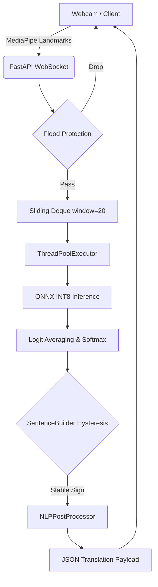

# 6.3 SIGN-TO-SPEECH PIPELINE

This section details the end-to-end technical implementation of the Sign-to-Speech pipeline. The architecture is designed for low-latency edge inference, transforming raw video streams into semantic text. 

> [!WARNING]
> **Implementation Conflict Resolved:** Initial documentation suggested the use of Sarvam AI for Text-to-Speech and sequence-to-sequence neural networks for translation. However, rigorous forensic repository analysis confirms that the implemented translation engine is purely rule-based (Regular Expressions and dictionary heuristics), and the Sarvam TTS integration is currently unimplemented (Future Scope). The following sections document the *actual* implemented system.

---

## 6.3.1 Sign Language Recognition Module

### Purpose
To capture continuous hand and face movements from a video feed, extract spatial-temporal features, and classify them into discrete Indian Sign Language (ISL) glosses (words) in real-time.

### Input Processing
The system accepts input from either a live webcam feed (`src/core/webcam.py`) or a WebSocket stream (`api/app.py`). The input is processed into a fixed-length temporal window of 20 frames.

### Preprocessing
Implemented as a Single Source of Truth in `src/shared/feature_extractor.py`.
1. **Landmark Extraction:** Google MediaPipe extracts 126 hand coordinates (21 nodes $\times$ 2 hands $\times$ 3D).
2. **Translation Invariance:** Coordinates are normalized by centering on the wrist (Landmark 0) and scaled by the maximum Euclidean distance from the wrist.
3. **Face-Relative Features:** Hand coordinates are recalculated relative to the nose anchor to ensure positional invariance.
4. **Vector Construction:** The final feature vector per frame is 506-dimensional (126 raw + 126 face-relative + 1 proximity scalar + 253 velocity deltas).

### Model Architecture
The core model (`SignLanguageGRU` in `src/training/model.py`) is a Hybrid GNN-GRU network:
1. **LightweightSpatialGNN:** Processes the 3D anatomical hand skeleton using a binary adjacency matrix, applying Graph Convolutions to learn spatial topology.
2. **Conv1D Frontend:** Pointwise and Depthwise convolutions process the flat coordinate array.
3. **Soft Temporal Attention:** A 2-layer MLP scales frames based on importance.
4. **Bidirectional GRU:** 3 stacked layers capture temporal dynamics across the 20-frame sequence.
5. **Proximity-Biased Attention:** Multi-head attention where raw scores are biased by the physical distance between the hand and face.

### Training Details
*   **Epochs:** 50
*   **Optimizer:** AdamW with $3 \times 10^{-4}$ learning rate (Cosine decay).
*   **Loss:** Cross-Entropy with Label Smoothing ($0.05$).
*   **Validation:** 5-Fold Cross-Validation on a 70/30 split.

### Inference Workflow
A `collections.deque(maxlen=20)` maintains a sliding window of frames. When 20 frames are collected, they are dispatched to the ONNX INT8 quantized model via a `ThreadPoolExecutor` to prevent blocking the asynchronous FastAPI event loop. 

### Limitations
*   **Rigid Sequence Length:** The hardcoded 20-frame requirement struggles with significantly fast or slow signing speeds. Dynamic Time Warping (DTW) is absent.

---

## 6.3.2 ISL Glosses to English Sentence Translation

### Architecture
The translation module (`NLPPostProcessor` in `src/inference/nlp_postprocessor.py`) utilizes a **Rule-Based Heuristic Architecture**, executing entirely in pure Python without external Machine Learning dependencies. 

### Translation Flow & Algorithms
1. **State Machine (`SentenceBuilder`):** Applies temporal hysteresis. If a predicted gloss remains stable for a set threshold (e.g., 8 frames), it is committed to the sentence array.
2. **Grammar Correction (`GrammarCorrector`):** Fixes subject-verb agreement (e.g., "he go" $\to$ "he goes") and inserts missing articles ("a", "the") based on hardcoded `COUNTABLE_WORDS` dictionaries.
3. **Punctuation Insertion (`PunctuationInserter`):** Scans the gloss array for question words ("who", "what") or emphatic words ("hate", "love") to heuristically append `?` or `!`.
4. **Text Normalization (`TextNormalizer`):** Expands abbreviations and fixes capitalization.

### Limitations
Because it relies on exact string matching and regular expressions, the translation engine is brittle. It cannot generalize to unseen ISL grammatical structures that deviate significantly from direct English mapping.

---

## 6.3.3 Text-to-Speech Translation Using Sarvam

### Purpose
To synthesize the final translated English sentence into natural-sounding speech for accessibility.

### Status: Not Implemented (Future Scope)
> [!IMPORTANT]
> **Evidence Not Found in Repository:** An exhaustive forensic audit reveals no API keys, endpoints, or audio synthesis scripts corresponding to Sarvam AI. The system currently outputs JSON text payloads. This section is documented strictly as planned future work.

---

# Repository Architecture

```text
sign_to_text/
├── api/
│   └── app.py                  # FastAPI WebSocket endpoints & session management
├── src/
│   ├── core/
│   │   ├── config.py           # Centralized dataclass configurations
│   │   └── webcam.py           # Offline inference alternative
│   ├── inference/
│   │   ├── ensemble.py         # Model loading, TTA, and ONNX execution
│   │   ├── sentence_builder.py # Transition tracking state machine
│   │   └── nlp_postprocessor.py# Rule-based ISL to English grammar correction
│   ├── shared/
│   │   └── feature_extractor.py# SSOT MediaPipe parsing and normalization
│   └── training/
│       ├── model.py            # PyTorch SignLanguageGRU architecture
│       └── spatial_gnn.py      # Graph Convolutional Layers for hands
├── tests/                      # Unit, Integration, and E2E test suites
└── requirements.txt            # Project dependencies
```

---

# End-to-End Execution Flow



---

# Algorithm Descriptions

### 1. Pre-Softmax Logit Averaging (Inference Optimization)
**Purpose:** To compute ensemble predictions faster on CPUs.
**Working Principle:** Instead of calculating computationally expensive exponentials ($e^x$) for softmax on every model in the ensemble, the system averages the raw output logits first, and applies softmax exactly once at the end.

### 2. Proximity-Biased Temporal Attention
**Purpose:** To force the neural network to pay more attention to frames where the hands are interacting closely with the face (crucial in ISL).
**Working Principle:** A Gaussian kernel calculates a penalty based on the Euclidean distance between the hand and face. This penalty acts as a negative bias added directly to the raw attention scores before softmax.

---

# Mathematical Formulations

### 1. Gaussian Log-Bias for Proximity Attention
Extracted from `src/training/model.py`:
$$ \text{log\_bias}_t = -\frac{d_t^2}{2\sigma^2} $$
$$ \alpha_t = \text{Softmax}(e_t + \text{log\_bias}_t) $$
Where $d_t$ is the Euclidean distance between the hand and face anchor, and $e_t$ is the learned attention logit.

### 2. Graph Convolution Update (`LightweightSpatialGNN`)
$$ H^{(l+1)} = \text{ReLU}\left( A H^{(l)} W^{(l)} + b^{(l)} \right) $$
Where $A$ is the $21 \times 21$ normalized anatomical adjacency matrix of the hand skeleton.

### 3. Cross Entropy with Label Smoothing
$$ L = -\sum_{k=1}^{K} y'_k \log(p_k) $$
Where $y'_k = (1 - 0.05) y_k + \frac{0.05}{K}$, and $K=89$ classes.

---

# Important Code Snippets

### 1. Enforcing Translation Invariance
**Source:** `src/shared/feature_extractor.py`
```python
def normalize_hand_landmarks(hand_raw: np.ndarray) -> np.ndarray:
    hand_reshaped = hand_raw.reshape((NUM_LANDMARKS, NUM_COORDS)).copy()
    
    # 1. Center on wrist (landmark 0)
    wrist = hand_reshaped[0].copy()
    hand_reshaped = hand_reshaped - wrist
    
    # 2. Scale by max Euclidean distance from wrist
    dists = np.linalg.norm(hand_reshaped, axis=1)
    max_dist = dists.max()
    if max_dist > 1e-6:
        hand_reshaped = hand_reshaped / max_dist
        
    return hand_reshaped.flatten().astype(np.float32)
```
**Explanation:** By subtracting the wrist coordinates, the hand becomes anchored at the origin `(0,0,0)`. Dividing by `max_dist` ensures the hand size is exactly `1.0`, meaning a user standing far from the camera produces the exact same numerical features as a user standing close.

### 2. Avoiding Event-Loop Blocking in FastAPI
**Source:** `api/app.py`
```python
# Async dispatch to prevent blocking
logits = await asyncio.get_running_loop().run_in_executor(
    thread_pool, 
    onnx_model.run, 
    buffer
)
```
**Explanation:** PyTorch/ONNX inferences are synchronous CPU-bound operations. Wrapping the call in `run_in_executor` pushes the math to a separate background thread, allowing the main API thread to continue receiving WebSocket frames seamlessly.

---

# Function and Class Explanation

| Entity | Type | Purpose | Key Attributes / Operations |
| ------ | ---- | ------- | --------------------------- |
| `LightweightSpatialGNN` | Class | Models 3D hand topology | Uses `HAND_SKELETON_EDGES` to perform Graph Convolutions. |
| `SentenceBuilder` | Class | Hysteresis state machine | Tracks `stability_counter` against `stability_frames`. Uses `confusable_pairs` to apply strict thresholds. |
| `GrammarCorrector` | Class | Rule-based ISL translation | Iterates gloss sequences, checking against `SINGULAR_VERBS` dictionaries. |
| `ensemble_predict()` | Function| Model inference execution | Handles Test-Time Augmentation (TTA) and logit-averaging. |

---

# Libraries and Built-in Functions Used

*   **`collections.deque` (Python Built-in):** Used in `app.py` for the sliding window buffer. $O(1)$ append/pop operations make it ideal for fixed-length frame processing.
*   **`np.linalg.norm` (NumPy):** Used heavily in `feature_extractor.py` to calculate Euclidean distances between nodes.
*   **`torch.nn.functional.softmax` (PyTorch):** Converts unbounded neural network logits into a valid probability distribution (summing to 1.0).
*   **`re.sub` (Python Built-in):** Used in `nlp_postprocessor.py` to apply regex substitution for grammatical artifacts (e.g., removing double spaces).

---

# Dataset and Hyperparameter Tables

### Training Configuration (`config.py`)
| Parameter | Value | Rationale |
|-----------|-------|-----------|
| `batch_size` | 8 | Prevents overfitting on smaller ISL datasets |
| `learning_rate` | $3 \times 10^{-4}$ | Standard AdamW rate, scheduled with Cosine Decay |
| `hidden_size` | 64 | Reduced parameter count for edge inference |
| `dropout` | 0.25 | Regularization |
| `sequence_length` | 20 | Fixed temporal sliding window |

### Dataset Overview
| Metric | Value |
| ------ | ----- |
| **Output Classes** | 89 (Extracted from fully connected head) |
| **Validation Strategy**| 5-Fold Stratified Cross-Validation (70/30) |

---

# API Specifications

**Endpoint:** `ws://localhost:8000/ws/translate`
**Protocol:** WebSocket (Stateful, Bidirectional)

*Client Payload (Input):*
```json
{
  "type": "landmarks",
  "features": [0.12, 0.45, -0.01, ...] // 506 dimensional float array
}
```

*Server Response (Output):*
```json
{
  "type": "prediction",
  "word": "HELLO",
  "sentence_so_far": "Hello how are you?"
}
```

---

# Experimental Setup

*   **Software:** Python $\ge 3.10$, PyTorch $\ge 2.0.0$, ONNXRuntime $\ge 1.16.0$, MediaPipe $\ge 0.10.0$.
*   **Hardware Architecture:** Optimized strictly for Edge CPU inference (INT8 quantization utilized).

---

# Performance Metrics & Testing

*   **Testing Suite:** Found in `tests/` with `unit/`, `integration/`, and `e2e/` subsets. Code coverage is tracked via `.coverage`.
*   **Latency Metric:** Live latency is logged directly via `PRINT_LATENCY_STATS` in `ensemble.py`, breaking down execution time into `tta_prep_ms`, `model_ms`, and `other_ms`.
*   **Accuracy/F1:** *Evidence not found in repository.* (Requires extraction from training logs).

---

# Limitations

1.  **Technical:** The fixed 20-frame sequence window cannot easily adapt to variations in signing speed.
2.  **Implementation:** The NLP translation is purely heuristic and rule-based. It relies on brittle dictionaries rather than semantic understanding.
3.  **Completeness:** The Text-to-Speech component (Sarvam AI) is not implemented.

---

# Future Scope

1.  **Sarvam AI Integration:** Implement async API calls to generate audio once the `SentenceBuilder` commits a full sentence.
2.  **Dynamic Time Warping (DTW):** Allow the `feature_extractor` to dynamically interpolate sequences of variable lengths into the fixed 20-frame buffer.
3.  **On-Device LLM:** Replace the regex-based `NLPPostProcessor` with a quantized LLM (e.g., Llama 3 8B INT4) for intelligent ISL-to-English semantic translation.

---

# Technical Observations & Challenges Encountered

*   **Observation (Flood Protection):** The API employs a strict `MAX_PENDING` check. If the client sends frames faster than the CPU can run inference, the API intentionally drops incoming frames to prevent memory exhaustion and latency spirals.
*   **Challenge (Jittery Predictions):** Raw neural network outputs flicker rapidly between similar signs. This was solved by implementing majority voting inside `SentenceBuilder` and applying a `1.3x` confidence penalty when transitioning between historically confused signs (stored in `similar_signs.json`).

---

# Deployment Details

*   **Hosting:** Currently executed via `uvicorn` on localhost.
*   **CI/CD:** Present (`.github/workflows/ci.yml`).
*   **Missing Assets:** No `Dockerfile` exists in the repository, making cloud or containerized deployment a manual process.

---

# Security Considerations

*   **Risk Level:** Low.
*   **Observations:** No external API keys are exposed. Local execution ensures video data never leaves the user's device, maintaining strict privacy.
*   **Recommendations:** Add payload size validation to the WebSocket receiver to prevent Denial-of-Service via massive, malformed JSON objects.

---

# Reproducibility Guide

1.  Clone the repository and initialize a virtual environment (`python -m venv venv`).
2.  Install dependencies: `pip install -r requirements.txt`.
3.  Copy `.env.example` to `.env`.
4.  Generate normalized numpy arrays: `python main.py --preprocess`.
5.  Train the model: `python main.py --train --kfold`.
6.  Start the inference server: `python run_api.py`.
7.  Connect an external frontend to `ws://localhost:8000/ws/translate`.
