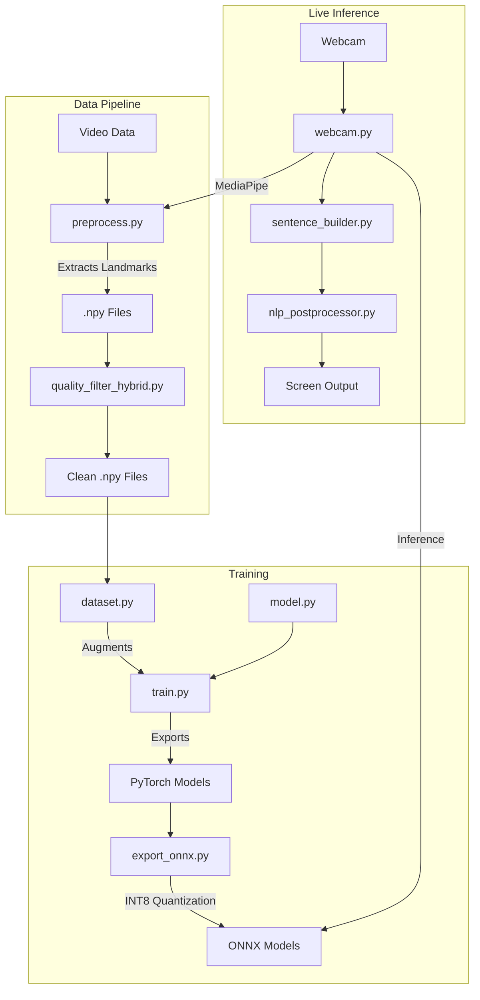

# Codebase Audit Report: ISL Sign-to-Text Pipeline

> [!NOTE]
> This document provides a comprehensive mental model and architectural audit of the Indian Sign Language (ISL) Sign-to-Text repository, broken down into the 7 requested phases.

## PHASE 1 — Repository Mapping

### Overview
This project is a real-time, low-latency machine learning pipeline for translating Indian Sign Language (ISL) into text. It uses webcam video as input, extracts topological landmarks, and runs sequence classification to predict words, which are then syntactically smoothed into sentences.

### Architecture Style
It follows a **Data-Driven ML Pipeline Architecture** combined with a **Real-Time Inference Loop**:
1. **Data Collection & Processing:** Video -> MediaPipe Landmarks -> Face-relative normalization -> `.npy` sequences.
2. **Training:** Dataset loading with augmentations (Mixup, oversampling) -> BiGRU + Attention model -> Focal Loss optimization.
3. **Inference:** Asynchronous Webcam Capture -> Landmark Extraction -> ONNX/PyTorch Inference -> Temporal Smoothing -> NLP Post-processing.

### Technology Stack
*   **Language:** Python
*   **Computer Vision:** OpenCV (Video I/O, UI, augmentations), MediaPipe (Hand/Face landmark extraction)
*   **Deep Learning:** PyTorch (Training, Adapter adaptation)
*   **Inference Acceleration:** ONNX Runtime (Quantized INT8 inference)
*   **Data Serialization:** Numpy (`.npy`)

### Major Modules
*   **Orchestration:** `main.py` (CLI entry point), `config.py` (Monolithic dataclass configuration).
*   **Preprocessing Pipeline:** `preprocess.py` (MediaPipe extraction, caching, augmentations).
*   **Core Neural Network:** `model.py` (BiGRU, Attention, SpatialGNN), `train.py` (Training loop, Mixup, K-fold).
*   **Live Inference:** `webcam.py` (God-file for live capture, UI, inference, tracking), `sentence_builder.py` (State machine for word transitions), `nlp_postprocessor.py` (Grammar correction).
*   **Synthetic Data Generation (New):** `cvae_landmarks.py`, `quality_discriminator.py`, `train_cvae.py`.

### Dependency Map & Data Flow

---

## PHASE 2 — Understand What Is Actually Used

### Active Code paths
*   `main.py`, `train.py`, `model.py`, `preprocess.py`, `config.py`, `dataset.py` form the unbreakable core.
*   `webcam.py` and `sentence_builder.py` are highly active and heavily optimized for real-time edge use.
*   ONNX export scripts (`export_onnx.py`, `quantize_onnx.py`) are actively used to bridge training and inference.

### Experimental / Edge Code
*   **Continuous Learning:** `adapter_model.py` and `adapter_training.py` introduce live pseudo-label collection and real-time fine-tuning during webcam inference. This is active but highly experimental.
*   **Synthetic Data:** The CVAE components (`cvae_landmarks.py`, `quality_discriminator.py`) appear to be recent experimental additions to combat data scarcity.

### Dead / Abandoned Code
*   `modify_train_kfold.py`: A fragile, one-off AST-modification script meant to patch `train.py`. Likely abandoned.
*   `quality_filter_npy.py`: Just a 3-line wrapper pointing to the newer `quality_filter_hybrid.py`.
*   `random_downsample_processed.py`: A utility script, but likely superseded by more robust dataset balancing in `train.py`.

---

## PHASE 3 — System Working State

### What Works Well
*   **The ML Pipeline:** The training loop is incredibly robust. It handles class imbalance via inverse frequency weighting, Focal Loss, and Mixup/Cutmix. 
*   **Inference Latency:** Heavy optimizations exist in `preprocess.py` (buffer reuse) and `webcam.py` (ONNX integration, asynchronous camera threading, MediaPipe caching) to ensure high FPS on CPU.
*   **Temporal Stability:** Advanced logic exists to prevent UI flickering (hysteresis, motion-gating, temporal smoothing, ambiguity delays).

### Fragile Areas
*   **MediaPipe Dependency:** The entire system breaks if hands leave the frame or MediaPipe loses tracking. There are hacks (motion tracking EMA, coordinate freezing) to mitigate this, but it remains a single point of failure.
*   **Live Adaptation:** The `AdapterModel` trains on pseudo-labels collected during inference. If the base model starts hallucinating with high confidence, the adapter will reinforce those hallucinations (catastrophic confirmation bias).

---

## PHASE 4 — Identify Technical Debt

> [!WARNING]
> While the ML logic is sophisticated, the software engineering architecture is beginning to suffer under its own weight.

1.  **The `webcam.py` God-Class Problem:**
    *   `webcam.py` is nearly 2,000 lines long. It handles UI drawing, threading, MediaPipe invocation, ONNX model loading, motion EMA math, pseudo-label buffer management, and sentence building state machines. This violates the Single Responsibility Principle and is very hard to maintain.
2.  **Configuration Monolith (`config.py`):**
    *   Configuration is hardcoded into a massive Python dataclass. Changing a hyperparameter requires modifying source code. It mixes filesystem paths, deep learning hyperparameters, and UI visual settings.
3.  **Filesystem Scalability (I/O Bottleneck):**
    *   Saving individual `.npy` files for every augmented video frame/sequence will quickly exhaust filesystem inodes and cause severe I/O bottlenecks during PyTorch `DataLoader` shuffling.
4.  **Coupling:**
    *   The preprocessing logic is heavily coupled to MediaPipe's exact output schema. If MediaPipe updates or is replaced, massive rewrites will be required.

---

## PHASE 5 — Infer Project Intent

**Goal:** The developers are trying to solve the hardest problems in edge AI: **real-world robustness on weak hardware with scarce data.**

*   **Evidence of Hardware Constraints:** Massive effort spent on CPU optimization (threading, buffer reuse, ONNX INT8 quantization, disabling HOG detectors during live inference).
*   **Evidence of Data Scarcity:** Implementation of Mixup, CutMix, CVAE synthetic generation, and live adapter fine-tuning. They don't have enough diverse data, so they are trying to generate it or learn it on the fly.
*   **Evidence of Real-World Noise Focus:** Implementation of "motion gating" (don't predict if hands aren't moving), face-relative coordinates (so tall vs short people don't break the model), and sentence-level grammar correction to hide model mistakes.

---

## PHASE 6 — Prioritized Action Plan

To move this project from an advanced prototype to a production-ready system, the following technical actions should be prioritized:

1.  **Refactor `webcam.py` (High Priority, Low Risk)**
    *   Extract the UI drawing logic into a `Renderer` class.
    *   Extract the motion tracking and hysteresis math into a `MotionTracker` class.
    *   Keep `webcam.py` strictly as the main orchestration loop.
2.  **Migrate Dataset Storage (Medium Priority, High Impact)**
    *   Replace individual `.npy` files with an `HDF5` (`.h5`) or `LMDB` database format. This will drastically improve training dataloader speed and prevent OS-level file limit issues.
3.  **Decouple Configuration (Medium Priority, Low Risk)**
    *   Migrate `config.py` defaults into a `config.yaml` file. Use `omegaconf` or `pyyaml` to load it. This allows for easy experiment tracking and avoids code changes for hyperparameter tuning.
4.  **Isolate MediaPipe (Low Priority, High Effort)**
    *   Create an abstract `LandmarkExtractor` interface. Wrap MediaPipe behind this interface so the downstream model only sees standardized numpy arrays, completely ignorant of the MediaPipe SDK.

---

## PHASE 7 — Executive Summary

The ISL Sign-to-Text project is a highly sophisticated, edge-optimized machine learning application. The developers have successfully implemented state-of-the-art techniques (ONNX INT8, Mixup, BiGRU+Attention, Temporal Smoothing) to make sign language recognition work in real-time on consumer CPUs. 

The primary bottlenecks are no longer related to machine learning accuracy, but rather **software engineering technical debt**. The monolithic nature of the configuration and live inference scripts (`webcam.py`) makes adding new features dangerous. Furthermore, the reliance on thousands of small `.npy` files will hinder future dataset scaling. 

By executing a targeted refactoring phase—specifically breaking apart `webcam.py` and modernizing the data storage layer—the project will be perfectly positioned to scale its vocabulary and safely integrate its experimental Synthetic Data and Live Adaptation features.
