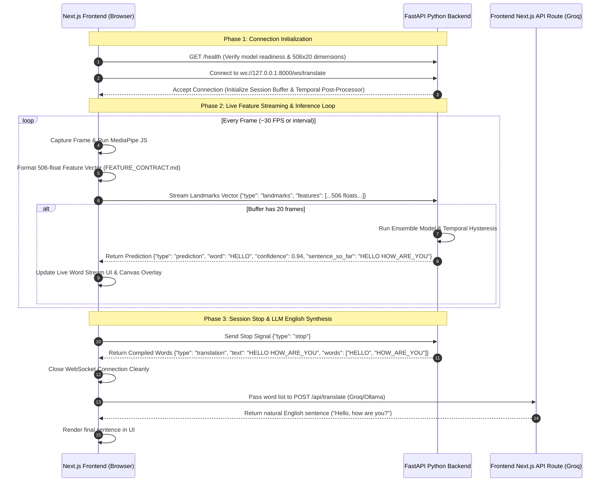

# Sign-to-Text API Protocol (VakSetu Real-Time Translation Specification)

This document specifies the official communication protocol between the **VakSetu Next.js Frontend** and the **Sign-to-Text API Server** (`sign_to_text_module`).

To maximize performance, reduce bandwidth overhead by ~95%, and achieve ultra-low latency real-time classification (<30ms per frame), MediaPipe landmark extraction is executed **client-side in the browser**. The frontend streams 506-dimensional preprocessed landmark feature vectors over a persistent WebSocket connection to the Python backend for machine learning classification.

---

## 1. Overview & Architectural Design

The real-time sign language translation module utilizes a stateful, bi-directional **WebSocket** connection.

### High-Level Data Flow



---

## 2. Connection Details

### 2.1 Transport Layer
- **Protocol:** WebSocket (RFC 6455)
- **URL Schema:** `ws://<backend-host>:<port>/ws/translate`
- **Default Development URL:** `ws://127.0.0.1:8000/ws/translate`

### 2.2 Client Lifecycle States

| State | Description | UI Manifestation |
| :--- | :--- | :--- |
| `IDLE` | No active connection. | Camera preview active, "Start Translating" button available. |
| `CONNECTING` | WebSocket handshake is in progress. | Loading spinner, controls disabled. |
| `TRANSLATING` | Connection established; features are streaming and predictions are returned. | Skeleton overlay rendering, recognized words streaming in real-time. |
| `ERROR` | Connection failed, timed out, or dimension mismatch. | Error toast/alert displayed, connection closed. |

---

## 3. Data Schemas (JSON Specification)

All communication over the WebSocket uses JSON-encoded payloads.

### 3.1 Client-to-Server Payloads

#### 3.1.1 Streaming Landmark Features (`landmarks`)
Sent continuously as frames are processed by client-side MediaPipe JS.
```json
{
  "type": "landmarks",
  "schema_version": "1.0",
  "feature_dimension": 506,
  "sequence_length": 20,
  "features": [0.012, -0.045, 0.123, "... 506 floats total ..."],
  "timestamp": 1698765432000
}
```
* **`type`** (string): Must be `"landmarks"`.
* **`schema_version`** (string): Must be `"1.0"`.
* **`feature_dimension`** (number): Must match backend expectation (`506`).
* **`sequence_length`** (number): Must match backend sliding buffer length (`20`).
* **`features`** (array of floats): Exactly 506 normalized floating-point numbers constructed according to `api/FEATURE_CONTRACT.md`.

#### 3.1.2 Stop Translation Signal (`stop`)
Sent when the user stops the translation session.
```json
{
  "type": "stop"
}
```

#### 3.1.3 Clear Session Signal (`clear`)
Sent to reset session memory and clear accumulated words without disconnecting.
```json
{
  "type": "clear"
}
```

---

### 3.2 Server-to-Client Responses

#### 3.2.1 Real-Time Prediction Response (`prediction`)
Returned when a new sign word is stabilized by the ensemble model and temporal post-processor.
```json
{
  "type": "prediction",
  "word": "HELLO",
  "confidence": 0.9452,
  "sentence_so_far": "HELLO HOW_ARE_YOU"
}
```
* **`type`** (string): Always `"prediction"`.
* **`word`** (string | null): Capitalized recognized sign word (e.g., `"HELLO"`). Returns `null` if confidence is below threshold or during transitional movements.
* **`confidence`** (float): Prediction confidence score (`0.0` to `1.0`).
* **`sentence_so_far`** (string): Space-separated list of committed words for the current session.

#### 3.2.2 Session Translation Summary (`translation`)
Sent in response to a `"stop"` payload.
```json
{
  "type": "translation",
  "text": "HELLO HOW_ARE_YOU",
  "words": ["HELLO", "HOW_ARE_YOU"]
}
```
* **`type`** (string): Always `"translation"`.
* **`text`** (string): Concatenated string of all committed signs.
* **`words`** (array of strings): Array of individual committed sign glosses.

#### 3.2.3 Session Cleared Response (`cleared`)
Sent in response to a `"clear"` payload.
```json
{
  "type": "cleared"
}
```

#### 3.2.4 Error Response (`error`)
```json
{
  "type": "error",
  "message": "Dimension mismatch. Expected 506x20."
}
```

---

## 4. Complementary REST Endpoints

### 4.1 Health Check (`GET /health`)
Recommended before opening the WebSocket to verify model readiness.
```json
{
  "status": "healthy",
  "schema_version": "1.0",
  "feature_dimension": 506,
  "sequence_length": 20,
  "model_loaded": true
}
```

### 4.2 Feature Verification (`POST /validate_features`)
Used during development to verify that frontend MediaPipe transformations match backend expectations.
